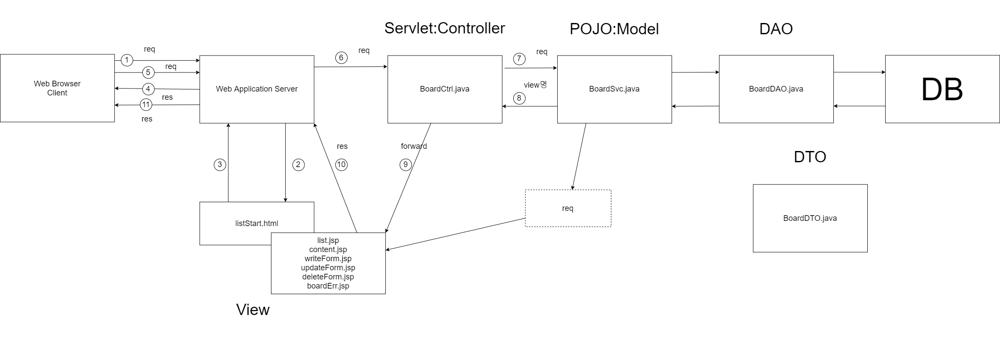
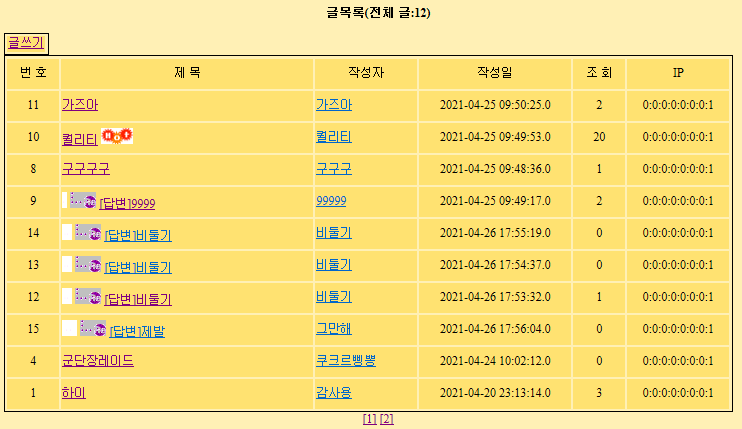

# PracticeJava
###### 이 문서는 저의  Java 복습을 위해 직접 만들었습니다.👍

###### 문서내용이 도움이 되셨으면 좋겠습니다.

###### Spring은 포함되어 있지 않습니다. 추후 업데이트할 수 있으면 해보겠습니다.


## 계층형 구조 게시판

###### 계층형 구조를 가진 게시판 MVC Model-2 로 제작  

###### Code view - [Board](https://github.com/GtYoo/PracticeJava/tree/main/board_mvc)  


- MVC Diagram

  MVC다이어그램을 통한 기본 구조 이해

  

  각각의 역할에 맡는 기능만 수행하게 해야 한다.  (유지보수 / Java코드분리로 원활한 수정을 위함) 

  `View`에서는 `JSTL`과 `EL (Expression Language)`만을 사용하여 페이지 처리한다.  

  `Controller` (Servlet)는 리퀘스트의 전달과 `Model`에서 보내오는 페이지이름만을 컨트롤한다.  

  `Model` (Service)은 DAO의 쿼리문 의외의 모든 부분을 담당한다. `DB Connect` / `DB Close` / `DB Commit` / `DB Rollback` 포함

  

- Data Base

  Oracle SQL을 사용했다. 

  

  보드 테이블

  ```sql
  CREATE TABLE BOARD
  (
      NUM         NUMBER(4)       PRIMARY KEY,
      WRITER      VARCHAR2(20),
      EMAIL       VARCHAR2(30),
      SUBJECT     VARCHAR2(100),
      PASSWD      VARCHAR2(20),
      REG_DATE    DATE            DEFAULT SYSDATE,
      READCOUNT   NUMBER(4)       DEFAULT 0,		
      REF         NUMBER(4),
      RE_STEP     NUMBER(4),
      RE_LEVEL    NUMBER(4),
      CONTENT     VARCHAR2(4000),
      IP          VARCHAR2(20)
  );
  ```

  

- Model

  `Service`에서 담당하는 역할은 `Controller`부터 `Request`를 받아와 `DAO`에서 일을 시키며 처리한 결과를 보여줄 Page명만 `Controller`로 전달한다. 계산이 필요한 부분들은 `Service`에서 처리한다. `Service` / `DAO` / `DTO` 모두 POJO : Model에 속한다.

  [Model Code](https://github.com/GtYoo/PracticeJava/tree/main/board_mvc/board)

  

- View

  보여지는 page 부분을 담당한다. `JSTL` / `EL` 을 사용하며 Java 코드 분리를 통해 유지보수를 수월하게 만들어 준다. `Model`의 `Service`로부터 데이터들을 받고 보여준다. 속성을 이용하여 JSP 페이지 간 값을 전달한다.

  [View Code](https://github.com/GtYoo/PracticeJava/tree/main/board_mvc)

  

  `Service`의 단건조회 데이터 저장

  ```java
  request.setAttribute("ONELIST", boardDto);
  request.setAttribute("PAGENO", nPageNo);
  ```

  

  `content.jsp` 에서 EL을 사용해 데이터 뷰

  ```jsp
  <tr height="30">
  	<td align= "center" width="125" bgcolor="<%=value_c %>">글번호</td>
  	<td align= "center" width="125" align="center">
  		${ONELIST.num}</td>
  	<td align="center" width="125" bgcolor="<%=value_c%>"> 조회수</td>
  	<td align="center" width="125" align="center">
  		${ONELIST.readcount}</td>
  </tr>
  <tr height="30">
  	<td align ="center" width="125" bgcolor="<%=value_c%>">작성자</td>
  	<td align ="center" width="125" align="center">
  		${ONELIST.writer}</td>
  	<td align="center" width="125" bgcolor="<%=value_c%>"> 작성일</td>
  	<td align="center" width="125" align="center">
  		${ONELIST.reg_date}</td>
  </tr>
  <tr height="30">
  	<td align="center" width="125" bgcolor="<%=value_c%>">글제목</td>
  	<td align="center" width="375" align="center" colspan="3">
  		${ONELIST.subject}</td>
  </tr>		
  <tr>
  	<td align="center" width="125" bgcolor="<%=value_c%>">글내용</td>
  	<td align="left" width="375" colspan="3">
  		<pre>${ONELIST.content}</pre></td>
  </tr>
  ```

  

  주의할 점은 View에서 View페이지 전달은 MVC가 성립되지 않는다는 점이다.

  글쓰기 페이지로 이동할 때에도 Cotroller를 통해서 이동한다.

  ```jsp
  <table>
  	<tr>
  		<td align="right" bgcolor="<%=value_c %>">
  			<a href="/Myjsp/BoardCtrl?cmd=insert_Be">글쓰기</a>
  		</td>
  	</tr>
  </table>
  ```

  

- Controller

  WAS로부터 `Request`를 받고 어떤 페이지의 데이터를 처리할 것인지, 어떤 서비스 기능을 이용할 것인지 결정하는 곳이다.

  말그대로 `Controller`이며 어떠한 기능적인 측면, 처리부분은 하지않고 `Forward`로 페이지 핸들링만 담당한다.

  쿼리스트링을 이용해 페이지간 구분이 가능하다.

  [Controller Code](https://github.com/GtYoo/PracticeJava/blob/main/board_mvc/board/BoardCtrl.java)

  
  
  `Controller` 에서 파라미터를 cmd로 받은뒤 cmd의 값으로 어떤 서비스의 기능을 이용할건지 결정
  
  ```java
  String cmd = request.getParameter("cmd");
  if("sltMul".equals(cmd))			//전체조회
  {
  	try {
  		viewPage = svc.ArtiList(request, response);	
  	} catch(Throwable e) {
  		throw new ServletException(e);
  	}
  }
  else if("sltOne".equals(cmd))		//단건조회
  {
  	try {
  		viewPage = svc.artiListOne(request, response);
  	} catch(Throwable e) {
		throw new ServletException(e);
  	}
  }
  ```
  
  
  
  `Controller` 로 보내는 `View` 에서의 주소는 무조건 `Controller` 를 통해서만 이동
  
  ```jsp
  <tr height="30">
  	<td colspan="4" bgcolor="<%=value_c%>" align="right">
  		<input type="button" value="글수정" onclick="document.location.href='/Myjsp/BoardCtrl?cmd=update_Be&num=${ONELIST.num}&pageNum=${PAGENO}'">
  		   &nbsp;&nbsp;&nbsp;&nbsp;	
  		<input type="button" value="글삭제" onclick="document.location.href='/Myjsp/BoardCtrl?cmd=delete_Be&num=${ONELIST.num}&pageNum=${PAGENO}'">
		   &nbsp;&nbsp;&nbsp;&nbsp;
  		<input type="button" value="답글쓰기" onclick="document.location.href='/Myjsp/BoardCtrl?cmd=insert_Be&num=${param.num}&ref=${ONELIST.ref}&re_step=${ONELIST.re_step}
             &re_level=${ONELIST.re_level}'">
  		   &nbsp;&nbsp;&nbsp;&nbsp;
  		<input type="button" value="글목록" onclick="document.location.href='/Myjsp/BoardCtrl?cmd=sltMul&pageNum=${PAGENO}'"> <!-- 글목록으로 되돌아가기 이전페이지 -->
  	</td>
  </tr>
  ```
  
  

- 댓글

  댓글(REF)은 글의 글번호(Primary Key)를 값으로 가진다. 부모글의 그룹핑이라고 생각하면 이해하기 쉽다.

  RE_STEP은 댓글의 순번으로 부모글에서 댓글이 달릴 경우 RE_STEP의 값은 가장 최근의 값을 제외하고 이외의 댓글들은 +1씩 증가시킨다.  RE_LEVEL은 같은 층의 댓글들을 그룹핑한다. 댓글에 댓글이 달릴 경우 기존댓글에 +1 처리한다. 현재의 작업 방법은 댓글이 달릴때마다 모든 댓글들의 RE_STEP이 증가하는 방식이므로 추후 다른 방법으로 해결해보려한다.

  

  `DAO` 에서의 `REF`  처리  [BoardDAO.java](https://github.com/GtYoo/PracticeJava/blob/main/board_mvc/board/BoardDAO.java)

  ```java
  //댓글ref처리
  public int insertArtiRe(BoardDTO dto) throws Exception {
  		
  	String updateNum = "UPDATE BOARD SET RE_STEP = RE_STEP + 1"
  			+ "WHERE REF = ? AND RE_STEP > ?";
  		
  	int cnt = 0;
  		
  	pstmt = con.prepareStatement(updateNum);
  		
  	pstmt.setInt(1, dto.getRef());
  	pstmt.setInt(2, dto.getRe_step());
  		
  	cnt = pstmt.executeUpdate();
  		
  	BoardCommon.dbClose(pstmt);
  		
  	return cnt;
  }
  ```

  

  `Service` 의 `insert` 메소드  [BoardSvc.java](https://github.com/GtYoo/PracticeJava/blob/main/board_mvc/board/BoardSvc.java)

  ```java
  int ref 		= Integer.parseInt((String)request.getParameter("ref"));
  int re_step 	= Integer.parseInt((String)request.getParameter("re_step"));
  int re_level 	= Integer.parseInt((String)request.getParameter("re_level"));
  
  int number = 0;
  number = boardDao.maxArtiNum();		//맥스글번호 구하기
  		
  if(num != 0)
  {
  	boardDto = new BoardDTO();
  	boardDto.setRef(ref);			//댓글일경우 ref 업뎃처리
  	boardDto.setRe_step(re_step);
  				
  	boardDao.insertArtiRe(boardDto);
  				
  	re_step = re_step + 1;
  	re_level = re_level + 1;
  }
  else
  {
  	ref = number;
  	re_step = 0;
  	re_level = 0;
  }
  ```

  

- 어려웠던 점

  기본적으로 insert / update / delete 부분은 문제될게 없었다. 하지만 댓글같은 경우 댓글이 1개만 달리고 끝이 나는게 아니라 댓글에 댓글에 댓글이 달리듯이 무한정으로 달릴수 있다는 점에서 고민이 되었다. 교수님께서 말씀하시길 댓글이 1000만건이 달리게 되면 (그럴일은 없겟지만...) 모든 댓글들을 DB에서 처리 할때 무리가 갈것이다. 댓글 관리의 좀더 효율적인 방안을 생각해봐야 할것이다.

  

- 실행

  