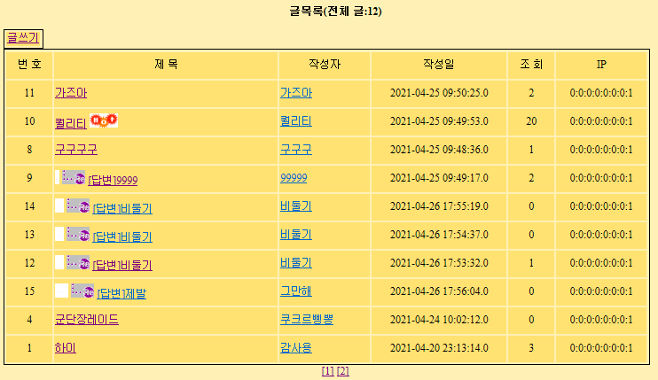

# PracticeJava
###### この文章は私の復習の為に直接作りました。👍

###### Springは含まれていません。今後出来ればアップデートしてみます。


## 階層構造掲示板

###### 階層形構造を持った掲示板 MVC Model-2 で制作  

###### Code view - [Board](https://github.com/GtYoo/PracticeJava/tree/main/board_mvc)  


- MVC Diagram

  MVC Diagramを通して基本的構造理解

  

  それぞれ役割に合わせた機能だけしなければならない。(運用・保守／Javaコードの分離で修正しやすくするため) 

  `View`では `JSTL`と `EL (Expression Language)`だけを使用してページを処理する。  

  `Controller` (Servlet)はリクエストの伝達と`Model`から送ってくるページ名だけコントロールする。  

  `Model` (Service)はDAOのクエリ以外の全てを担当する。 `DB Connect` / `DB Close` / `DB Commit` / `DB Rollback` 含む

  

- Data Base

  Oracle SQLを使用した。 

  

  ボードテーブル

  ```sql
  CREATE TABLE BOARD
  (
      NUM         NUMBER(4)       PRIMARY KEY,
      WRITER      VARCHAR2(20),
      EMAIL       VARCHAR2(30),
      SUBJECT     VARCHAR2(100),
      PASSWD      VARCHAR2(20),
      REG_DATE    DATE            DEFAULT SYSDATE,
      READCOUNT   NUMBER(4)       DEFAULT 0,		
      REF         NUMBER(4),
      RE_STEP     NUMBER(4),
      RE_LEVEL    NUMBER(4),
      CONTENT     VARCHAR2(4000),
      IP          VARCHAR2(20)
  );
  ```

  

- Model

  `Service`で担当する部分は`Controller`から`Request`を受け取って`DAO`に働かせて処理した結果を見せるページ名だけ`Controller`へ伝える。計算が必要な部分は`Service`で処理する。`Service` / `DAO` / `DTO`全部POJO : Modelに含まれる。

  [Model Code](https://github.com/GtYoo/PracticeJava/tree/main/board_mvc/board)

  

- View

  見せるpage部分を担当する。`JSTL` / `EL` を使い、Javaコード分離を通して運用・保守をしやすくなる。`Model`の`Service`からデータを貰って見せる。属性を利用してJSPページ間のValueを伝える。

  [View Code](https://github.com/GtYoo/PracticeJava/tree/main/board_mvc)

  

  `Service`の一つのデータセット

  ```java
  request.setAttribute("ONELIST", boardDto);
  request.setAttribute("PAGENO", nPageNo);
  ```

  

  `content.jsp`でELを使いデータビュー

  ```jsp
  <tr height="30">
  	<td align= "center" width="125" bgcolor="<%=value_c %>">글번호</td>
  	<td align= "center" width="125" align="center">
  		${ONELIST.num}</td>
  	<td align="center" width="125" bgcolor="<%=value_c%>"> 조회수</td>
  	<td align="center" width="125" align="center">
  		${ONELIST.readcount}</td>
  </tr>
  <tr height="30">
  	<td align ="center" width="125" bgcolor="<%=value_c%>">작성자</td>
  	<td align ="center" width="125" align="center">
  		${ONELIST.writer}</td>
  	<td align="center" width="125" bgcolor="<%=value_c%>"> 작성일</td>
  	<td align="center" width="125" align="center">
  		${ONELIST.reg_date}</td>
  </tr>
  <tr height="30">
  	<td align="center" width="125" bgcolor="<%=value_c%>">글제목</td>
  	<td align="center" width="375" align="center" colspan="3">
  		${ONELIST.subject}</td>
  </tr>		
  <tr>
  	<td align="center" width="125" bgcolor="<%=value_c%>">글내용</td>
  	<td align="left" width="375" colspan="3">
  		<pre>${ONELIST.content}</pre></td>
  </tr>
  ```

  

  注意すべきところはViewからViewへのページ伝達はMVCが成立しないというところだ。

  書きページへ移動する時もCotrollerを通して移動する。

  ```jsp
  <table>
  	<tr>
  		<td align="right" bgcolor="<%=value_c %>">
  			<a href="/Myjsp/BoardCtrl?cmd=insert_Be">글쓰기</a>
  		</td>
  	</tr>
  </table>
  ```

  

- Controller

  WASから `Request`を貰い、どんなデータを処理するか、どんなサービス機能を利用するかをコントロールするところである。

  文字通り`Controller`でいかなる機能、処理をせず`Forward`へのページハンドリングだけを担当する。

  クエリストリングを利用してページ間の区分が可能だ。

  [Controller Code](https://github.com/GtYoo/PracticeJava/blob/main/board_mvc/board/BoardCtrl.java)

  
  
  `Controller`でパラメータをcmdで受け取ってcmdのValueでどんなサービスの機能を利用するか決定する。
  
  ```java
  String cmd = request.getParameter("cmd");
  if("sltMul".equals(cmd))			//전체조회
  {
  	try {
  		viewPage = svc.ArtiList(request, response);	
  	} catch(Throwable e) {
  		throw new ServletException(e);
  	}
  }
  else if("sltOne".equals(cmd))		//단건조회
  {
  	try {
  		viewPage = svc.artiListOne(request, response);
  	} catch(Throwable e) {
		throw new ServletException(e);
  	}
  }
  ```
  
  
  
  `Controller`に送る`View`での住所は必ず`Controller`を通して移動させる。
  
  ```jsp
  <tr height="30">
  	<td colspan="4" bgcolor="<%=value_c%>" align="right">
  		<input type="button" value="글수정" onclick="document.location.href='/Myjsp/BoardCtrl?cmd=update_Be&num=${ONELIST.num}&pageNum=${PAGENO}'">
  		   &nbsp;&nbsp;&nbsp;&nbsp;	
  		<input type="button" value="글삭제" onclick="document.location.href='/Myjsp/BoardCtrl?cmd=delete_Be&num=${ONELIST.num}&pageNum=${PAGENO}'">
		   &nbsp;&nbsp;&nbsp;&nbsp;
  		<input type="button" value="답글쓰기" onclick="document.location.href='/Myjsp/BoardCtrl?cmd=insert_Be&num=${param.num}&ref=${ONELIST.ref}&re_step=${ONELIST.re_step}
             &re_level=${ONELIST.re_level}'">
  		   &nbsp;&nbsp;&nbsp;&nbsp;
  		<input type="button" value="글목록" onclick="document.location.href='/Myjsp/BoardCtrl?cmd=sltMul&pageNum=${PAGENO}'"> <!-- 글목록으로 되돌아가기 이전페이지 -->
  	</td>
  </tr>
  ```
  
  

- コメント

  コメント(REF)はリストの番号(Primary Key)をValueとして持つ。親リストのグループだと考えたら理解しやすい。

  RE_STEPはコメントの順番でコメントが書かれた場合RE_STEPの値は一番最近の値を除いて他のコメントは +1増加させる。RE_LEVELは同じ段階のコメントをグループさせる。コメントにコメントが書かれた場合元々あったコメントを+1処理する。現在のやり方ではコメントが次々書かれた時、全てのコメントのRE_STEPが増加しているやり方なので今後他の方法で解決しようと思っている。

  

  `DAO`での`REF` 処理  [BoardDAO.java](https://github.com/GtYoo/PracticeJava/blob/main/board_mvc/board/BoardDAO.java)

  ```java
  //댓글ref처리
  public int insertArtiRe(BoardDTO dto) throws Exception {
  		
  	String updateNum = "UPDATE BOARD SET RE_STEP = RE_STEP + 1"
  			+ "WHERE REF = ? AND RE_STEP > ?";
  		
  	int cnt = 0;
  		
  	pstmt = con.prepareStatement(updateNum);
  		
  	pstmt.setInt(1, dto.getRef());
  	pstmt.setInt(2, dto.getRe_step());
  		
  	cnt = pstmt.executeUpdate();
  		
  	BoardCommon.dbClose(pstmt);
  		
  	return cnt;
  }
  ```

  

  `Service` の `insert` メソッド  [BoardSvc.java](https://github.com/GtYoo/PracticeJava/blob/main/board_mvc/board/BoardSvc.java)

  ```java
  int ref 		= Integer.parseInt((String)request.getParameter("ref"));
  int re_step 	= Integer.parseInt((String)request.getParameter("re_step"));
  int re_level 	= Integer.parseInt((String)request.getParameter("re_level"));
  
  int number = 0;
  number = boardDao.maxArtiNum();		//맥스글번호 구하기
  		
  if(num != 0)
  {
  	boardDto = new BoardDTO();
  	boardDto.setRef(ref);			//댓글일경우 ref 업뎃처리
  	boardDto.setRe_step(re_step);
  				
  	boardDao.insertArtiRe(boardDto);
  				
  	re_step = re_step + 1;
  	re_level = re_level + 1;
  }
  else
  {
  	ref = number;
  	re_step = 0;
  	re_level = 0;
  }
  ```

  

- 難しかったところ

  基本的に insert / update / delete 部分は問題にならなかった。しかし、コメントの場合、コメントが一つ書かれて終わりではなくコメントにコメントが、またコメントにコメントが書かれるところが悩ませた。教授先生からの言葉を借りると例えコメントが１千万件ついた場合(そんなことありませんけど…)、全てのコメントをDBで+1の処理を行われたら考えるだけでしんどい。コメント管理に対してもっと効率的な方法を考えてみるべきだ。

  

- 実行

  